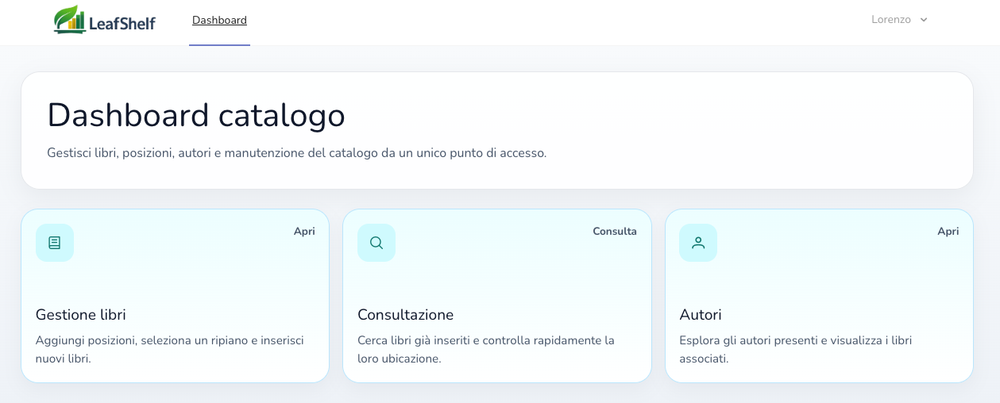
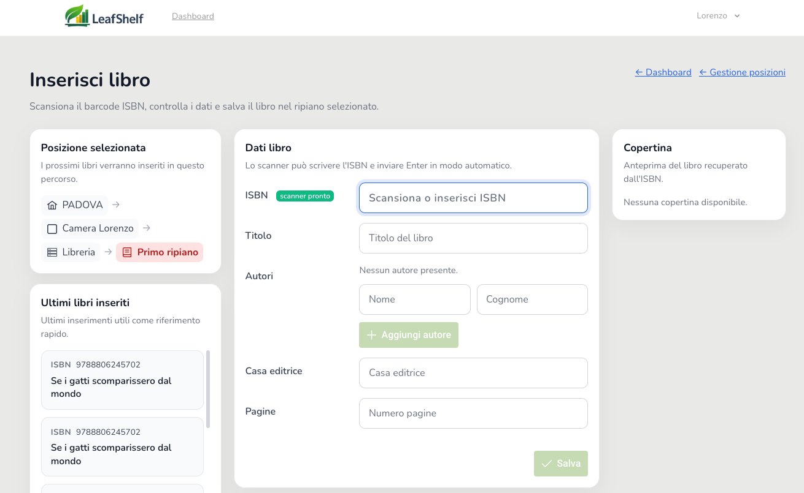
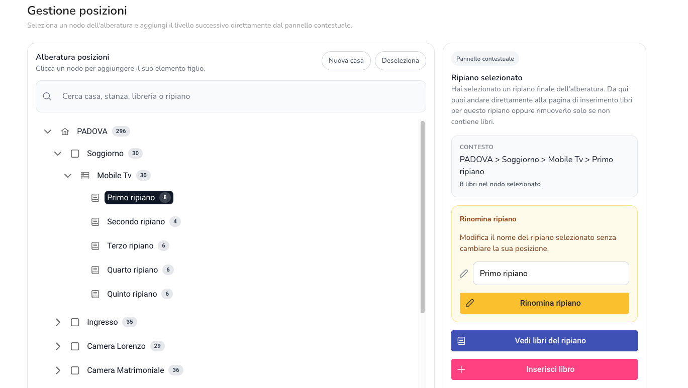

> Personal project developed to manage a physical book collection using barcode scanning and hierarchical location tracking.

# LeafShelf


LeafShelf is a personal library management web application designed to organize physical books using a hierarchical location system.

The application allows users to catalog books, assign them to real-world shelves, and quickly retrieve them using ISBN lookup and barcode scanning.

---

## Features

- **Hierarchical library structure**
    - Buildings → Rooms → Bookshelves → Shelves
- **Book insertion via ISBN**
    - Automatic metadata retrieval from external APIs
- **Barcode scanner support**
    - Quickly add books using a physical ISBN scanner
- **REST-style Laravel backend**
- **Vue + Inertia frontend**
- **Toast-based UI feedback**
- **Shelf-based navigation**
    - View all books located on a specific shelf
- **External API integration**
    - OpenLibrary fallback with local caching

---

---

## Screenshots

### Dashboard



### Book Insertion



### Library Structure



## Tech Stack

### Backend

- PHP
- Laravel
- Eloquent ORM
- REST-style routing

### Frontend

- Vue.js
- Inertia.js
- PrimeVue components

### Infrastructure

- MySQL
- Axios
- External ISBN APIs

---

## Architecture

LeafShelf follows a Laravel + SPA architecture designed to keep backend logic and UI responsibilities clearly separated.

- **Laravel** handles domain logic, database access and REST-style endpoints
- **Vue + Inertia** provides a reactive single-page application experience
- **Axios** is used for API communication
- **External book APIs** provide metadata via ISBN lookup

The system models the **physical structure of a real library**, allowing books to be located precisely using the hierarchy:

Building → Room → Bookshelf → Shelf → Book

---

## Project Structure

app/
├── Http
│ ├── Controllers
│ └── Resources
├── Models

resources/
├── js
│ ├── Pages
│ ├── Components
│ └── Layouts

routes/
└── web.php

---

## Main Workflow

1. Select a **shelf location**
2. Scan or enter an **ISBN**
3. Metadata is retrieved from external APIs
4. The book is saved and assigned to the selected shelf

---

## Why this project

LeafShelf was created to solve a real-world problem: managing a growing personal library of physical books.

Most cataloging tools focus only on metadata, while LeafShelf focuses on **where the book actually is** in the physical space.

The project emphasizes:

- pragmatic Laravel architecture
- clear REST API design
- simple and efficient UI workflows
- integration with external book metadata providers

---

## Example API Request

## Retrieve book metadata via ISBN:

GET /api/books/isbn/9780141182636
Response:
{
"title": "The Great Gatsby",
"authors": ["F. Scott Fitzgerald"],
"publisher": "Scribner",
"isbn": "9780141182636"
}

## Installation

```bash
# Clone the repository
git clone https://github.com/templarec/LeafShelf.git
cd LeafShelf

# Install backend dependencies
composer install

# Install frontend dependencies
npm install

# Create environment file
cp .env.example .env

# Generate application key
php artisan key:generate

# Run database migrations
php artisan migrate

# Start Laravel development server
php artisan serve

# Start frontend dev server
npm run dev
```
